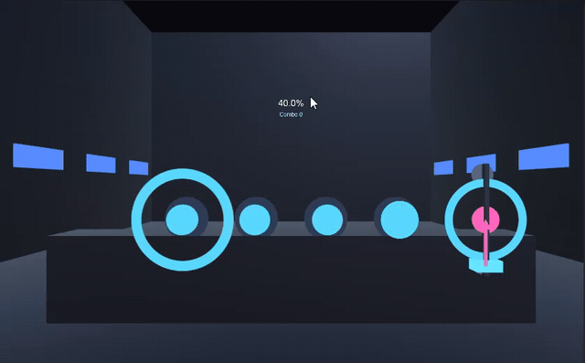

New thread here: a devlog for **VJ Simulator**, a game I'm building on the
side. This one's a VR project first and foremost — the idea is you're
standing in a booth with a song playing, and instead of dancing or hitting
notes yourself, you're the one running the show: swinging lights, firing
lasers, cueing platforms, all in time with the music. Think less "rhythm
game player" and more "rhythm game performer."

It's very early. Right now there's just a small proof of concept running on
keyboard, no headset involved yet — enough to prove the core "react to the
beat" loop actually feels good before I sink time into VR input and staging.
Longer term I'd like modding and shareable custom songs/light-shows, and
maybe a multiplayer mode where two people VJ back to back.

Nothing's locked in and a lot will probably change. Mostly starting this
thread so there's a record of it as it goes, and so future me remembers why
past me made the choices I did. More soon.
