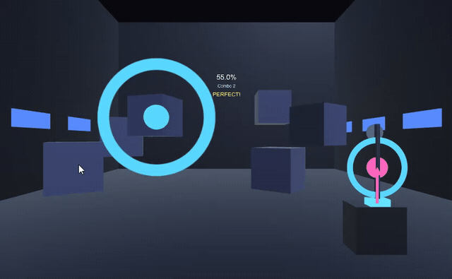

Quick follow-up to the first entry. Since that proof of concept, three things
happened, all pushing toward the same goal: getting this into a headset.

First, I pulled in a VR starter template so the project actually has the XR
plumbing — controllers, headset tracking, all of it — available to build on.
Nothing playable changed yet, it's just the scaffolding.

Second, and more fun: the game now runs in an actual 3D room instead of flat
on-screen lanes. Gear is scattered around the space, and a ring shrinks down
around whatever you need to hit next so the timing reads correctly no matter
where you're standing or looking — which matters a lot once your head can
actually move around, unlike a fixed camera.

Third, hits now do something. Pressing a button on time can spin or pulse
whatever piece of scenery it's wired to, rather than just registering a score.
Early days, but it's the first hint of what "being the VJ" is actually going
to feel like.

Still playing this with a mouse, not a headset — that's the obvious next step.
More soon.
